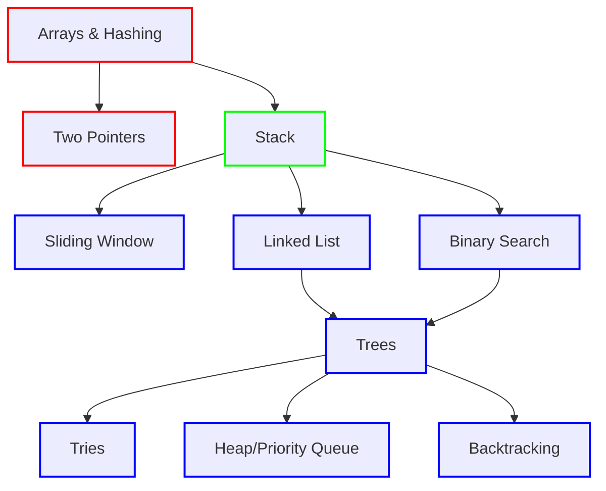

## NeetCode [url](https://neetcode.io/)

## Progress

- `completed` (red)
- `inProgress` (green)
- `notStarted` (blue)

```mermaid
graph TD;
    classDef completed stroke:#f00,stroke-width:2px;
    classDef inProgress stroke:#0f0,stroke-width:2px;
    classDef notStarted stroke:#00f,stroke-width:2px;

    A[Arrays & Hashing]:::completed;
    B[Two Pointers]:::completed;
    C[Stack]:::inProgress;
    D[Sliding Window]:::notStarted;
    E[Linked List]:::notStarted;
    F[Binary Search]:::notStarted;
    G[Trees]:::notStarted;
    H[Tries]:::notStarted;
    I[Heap/Priority Queue]:::notStarted;
    J[Backtracking]:::notStarted;

    A --> B;
    A --> C;
    C --> D;
    C --> E;
    C --> F;
    E --> G;
    F --> G;
    G --> H;
    G --> I;
    G --> J;
```
