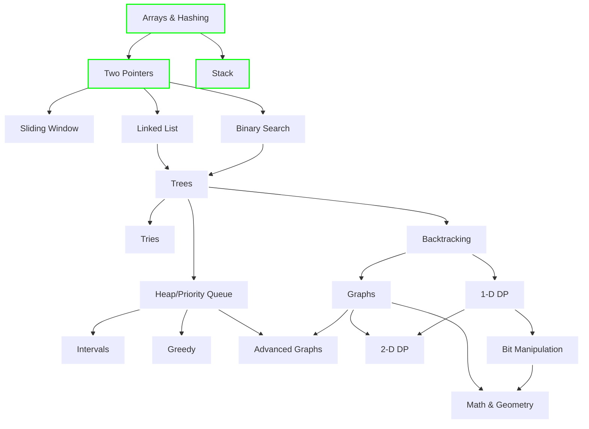

## NeetCode [url](https://neetcode.io/)

## Progress (21/150)

- `completed` (green)
- `inProgress` (blue)
- `notStarted` (white)

**Roadmap**

```mermaid
graph TD;
    classDef completed stroke:#0f0,stroke-width:2px;
    classDef inProgress stroke:#00f,stroke-width:2px;
    classDef notStarted stroke:#fff,stroke-width:2px;

    A[Arrays & Hashing]:::completed;
    C[Two Pointers]:::completed;
    B[Stack]:::completed;
    D[Sliding Window]:::notStarted;
    E[Linked List]:::notStarted;
    F[Binary Search]:::notStarted;
    G[Trees]:::notStarted;
    H[Tries]:::notStarted;
    I[Heap/Priority Queue]:::notStarted;
    J[Backtracking]:::notStarted;
    K[Intervals]:::notStarted;
    L[Greedy]:::notStarted;
    M[Advanced Graphs]:::notStarted;
    P[2-D DP]:::notStarted;
    N[Graphs]:::notStarted;
    O[1-D DP]:::notStarted;
    Q[Bit Manipulation]:::notStarted;
    R[Math & Geometry]:::notStarted;

    A --> B;
    A --> C;
    C --> D;
    C --> E;
    C --> F;
    E --> G;
    F --> G;
    G --> H;
    G --> I;
    G --> J;
    I --> K;
    I --> L;
    I --> M;
    J --> N;
    J --> O;
    N --> M;
    N --> P;
    N --> R;
    O --> P;
    O --> Q;
    Q --> R;
```
